# FartherViewDistance — Mermaid Diagrams

These diagrams explain how the plugin works, from a server owner’s view to a deep technical view.

---

## 1) “What happens when the plugin runs?”

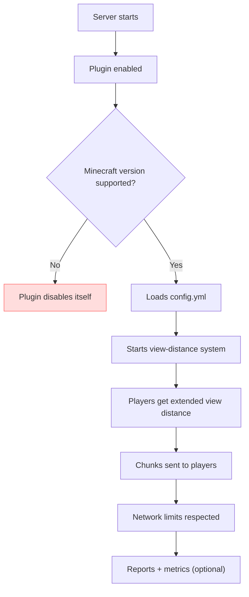

**What you can control:**
- View distance mode and limits (config.yml).
- Per-world limits and safety caps (config.yml).
- Whether metrics (bStats) are enabled.

---

## 2) Startup lifecycle

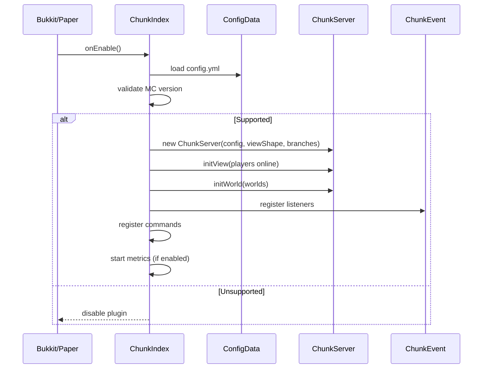

---

## 3) Runtime ticks + threads

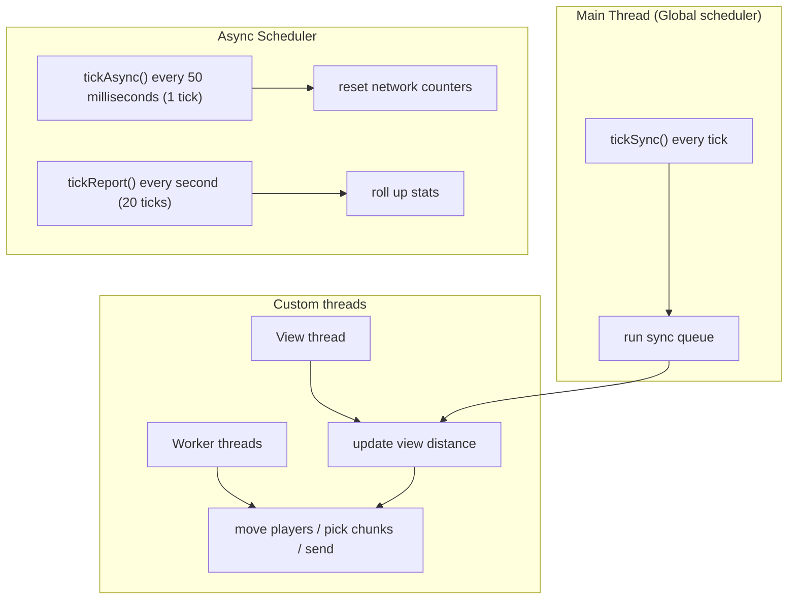

---

## 4) Chunk sending pipeline

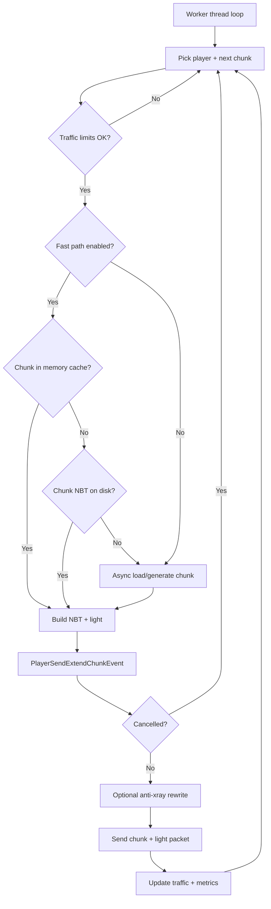

**Gatekeepers before a chunk is processed**
- `ChunkServer.runThread` reevaluates `globalPause`, the global/world/player traffic counters, generation caps, `view.waitSend`, and the `PlayerChunkView` `moveTooFast` flag before it hands a chunk key to the pipeline.
- The view keeps per-player pacing via `PlayerChunkView.waitSend`, `delay()`/`delayTime`, and `next()`, which also honors the player's world border, `syncKey`, and forced delays so stale or out-of-range chunks never make it into the fast path.

---

## 5) Packet & event interception

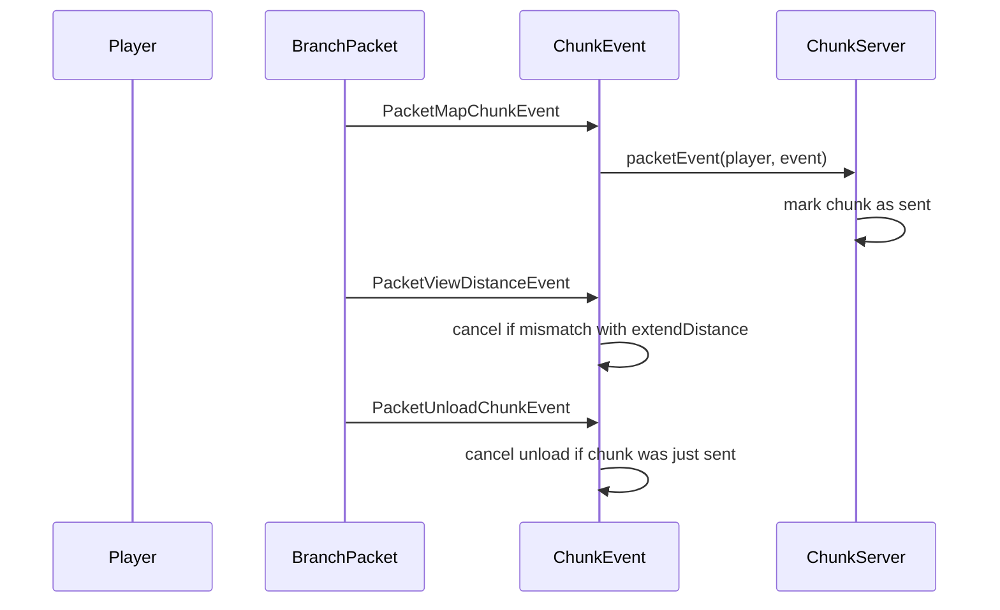

---

## 6) View-distance computation

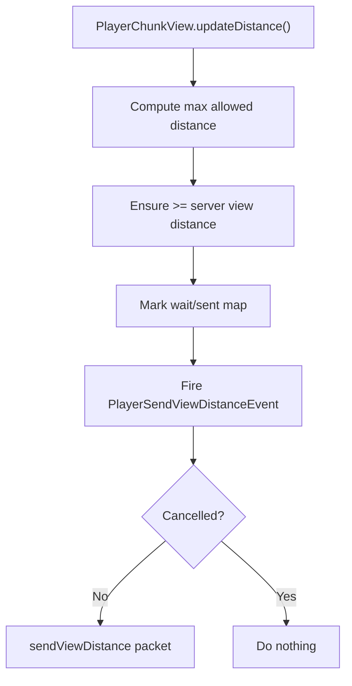

---

## 7) Config impacts (simple)

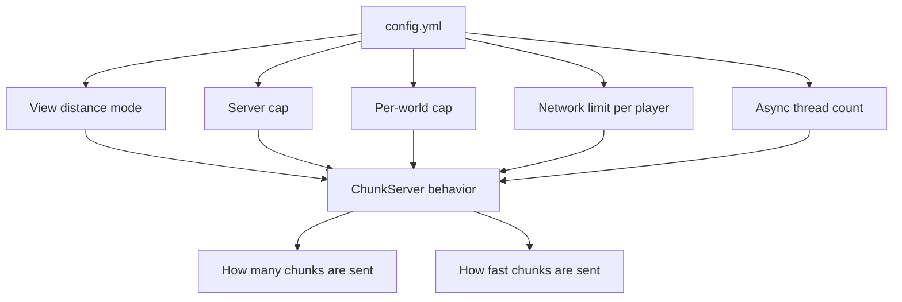

---

## 8) Metrics (optional)

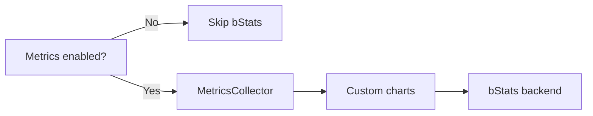

---

## 9) Packet proxy + routing

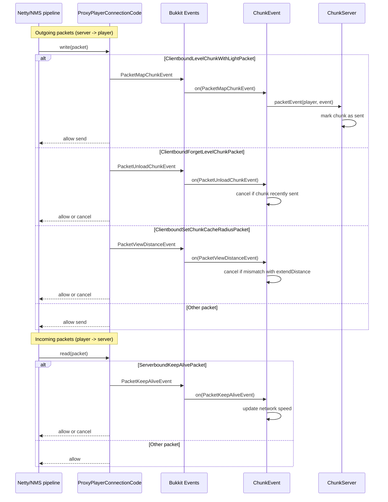

**Keep-alive-based network timing**
- `ChunkEvent.on(PacketKeepAliveEvent)` cancels keep-alive responses that match the view's pending ping or speed IDs so the plugin can measure the round-trip and throughput without spamming the client.
- `ChunkServer.sendChunk` consumes those measurements via `PlayerChunkView.networkSpeed` before and after each chunk send, which lets the worker threads enforce the auto-adaptive per-player bandwidth limits before emitting more data.

---

## 10) Anti-overload logic: “How it avoids too many chunk ticks”

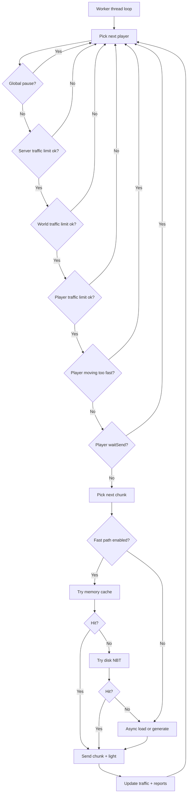

---

## 11) Chunk generation safety caps (server + world)

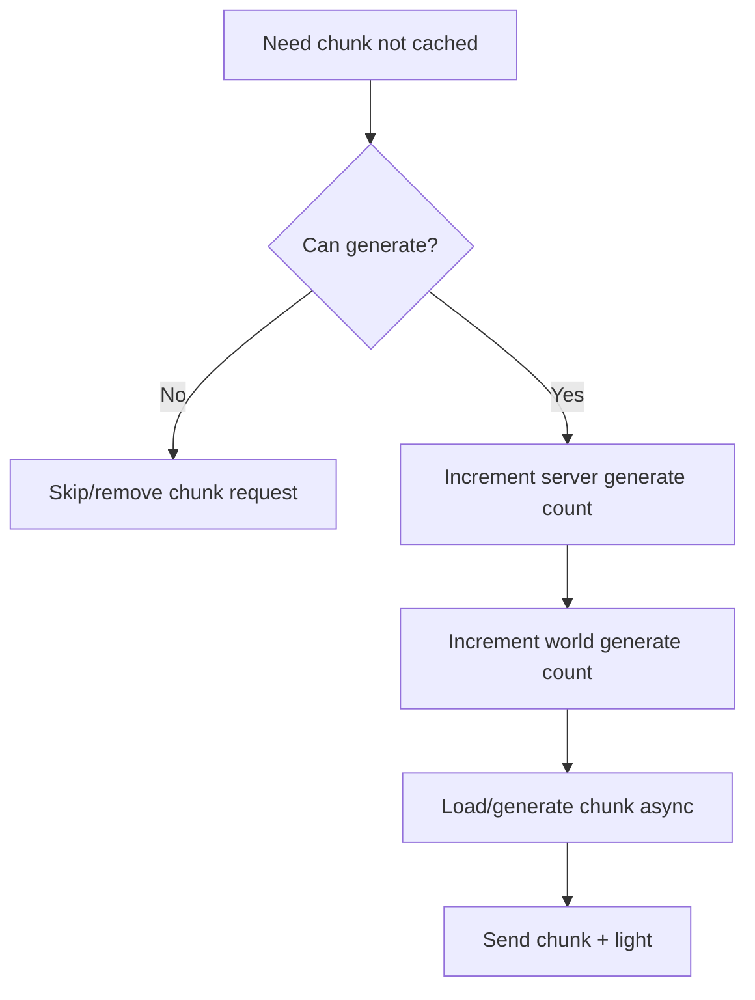

---

## 12) View install/unload cycle (why it avoids heavy re-sends)

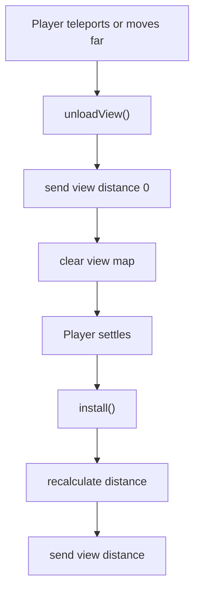
